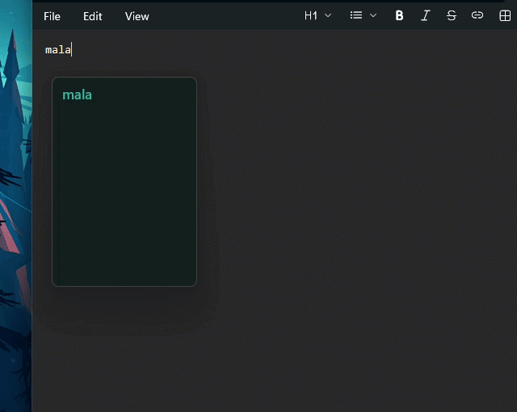
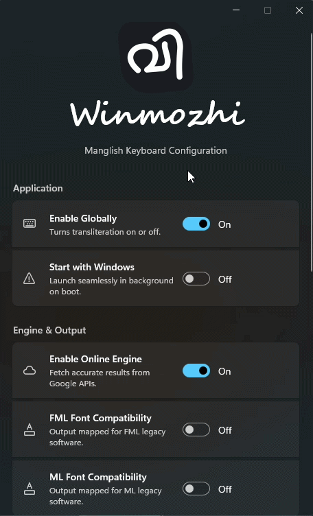

<div align="center">


# ⌨️ Winmozhi (വിൻമൊഴി)

### The Ultimate Manglish → Malayalam Keyboard for Windows

*Type Malayalam effortlessly across your entire system — fast, native, elegant, and intelligent.*

🌐 **[Official Website: winmozhi.com](https://winmozhi.com/)**

<br/>


<br/>

### ✨ Native • Fast • Source-Available • Beautiful

</div>

---

## 🌟 About Winmozhi

**Winmozhi** is a blazing-fast, system-wide Malayalam transliteration keyboard for Windows that converts **Manglish → Malayalam** in real time. 

Unlike traditional input method editors (IMEs) that feel clunky, Winmozhi is built natively using **WinUI 3** and **.NET 10**. It utilizes low-level Win32 keyboard hooks to integrate deeply with Windows, delivering a smooth, lightweight, and modern typing experience that feels like a natural part of the operating system.

Whether you're chatting on WhatsApp, writing code, designing in Photoshop, or editing videos in Premiere Pro — Winmozhi works everywhere.

---

## 📸 Demo

<div align="center">


&nbsp; &nbsp; &nbsp;


<br/>
<i>Left: Intelligent System-Wide Typing Popup | Right: Native WinUI 3 Settings</i>

</div>

---

## ✨ Features

### 🚀 Hybrid Transliteration Engine
Winmozhi combines multiple intelligent systems to provide extremely accurate Malayalam typing instantly.
- ⚡ **Zero-allocation Parser:** Translates keystrokes in sub-milliseconds.
- 📚 **Offline Engine:** Trie-based prediction using a bundled Manglish-Malayalam corpus.
- 🌐 **Online Engine:** Seamless fallback to Google Input Tools API for complex words.

### 🧠 Intelligent Fuzzy Matching
Winmozhi automatically understands phonetic variations and typing mistakes.

| You Type | Winmozhi Understands |
|:---|:---|
| `sukham` or `sugham` | സുഖം |
| `njan` or `njaan` | ഞാൻ |
| `malayalm` | മലയാളം |

### 🔤 Legacy Design Software Support (FML/ML)
Winmozhi supports direct typing into legacy Malayalam font workflows, making it the perfect tool for designers and editors.
- Output mapped for **FML** & **ML** legacy fonts.
- Tested specifically for Adobe Photoshop, Premiere Pro, PageMaker, and legacy DTP software.

### 🎨 Beautiful Native Windows UI
Designed specifically for **Windows 11** with a clean and modern aesthetic.
- 🌈 **Acrylic & Mica Materials** for native transparency.
- 🪟 **Floating Popup** that intelligently tracks your cursor, even across multiple monitors.
- 🎛️ **Fully Customizable:** Adjust popup colors, text scaling, and opacity.

### ⚡ System-Wide Hotkey
Instantly enable or disable transliteration anywhere using:
> **<kbd>Ctrl</kbd> + <kbd>Shift</kbd> + <kbd>M</kbd>**

---

## 🚀 Installation (For Users)

Winmozhi uses an automated CI/CD pipeline to generate ready-to-use installers for both Intel/AMD (x64) and Snapdragon (ARM64) devices.

1. Go to the [Releases page](../../releases/latest).
2. Download the `.exe` installer for your system:
   - `Winmozhi_Installer_x64.exe` (Most standard PCs)
   - `Winmozhi_Installer_arm64.exe` (Snapdragon/ARM PCs)
3. Run the installer and launch Winmozhi!

*(Note: Because Winmozhi is open-source and not signed with an expensive EV certificate, Windows SmartScreen may show a blue warning. Click **"More Info"** -> **"Run Anyway"**).*

---

## 🕹️ How to Use

1. **Launch:** Ensure the `മ` icon is visible in your Windows System Tray.
2. **Type:** Open any app (Word, Browser, Photoshop) and start typing in Manglish (e.g., `namaskaram`).
3. **Popup:** A floating popup will appear near your text cursor with Malayalam suggestions.
4. **Insert:** Press `<Space>` to insert the highlighted word, or use `↑` `↓` arrows to navigate alternative suggestions.
5. **Pause:** Press `Ctrl + Shift + M` to pause the engine and type in normal English.

---

## 🛠️ For Developers & Open Source Contributors

Winmozhi is architected for maximum performance and readability using modern C# features. We welcome contributors!

### 🏗️ Project Structure
The solution is divided into three heavily decoupled layers:
* 📦 **`Winmozhi.Core`**: Contains all business logic, the Trie prediction engine, API clients, SQLite history database, and FML/ML converters. *(No UI code here).*
* 🪝 **`Winmozhi.Hooks`**: Manages the low-level `WH_KEYBOARD_LL` Win32 API hooks to intercept keystrokes system-wide.
* 🖥️ **`Winmozhi.UI`**: The WinUI 3 frontend containing the MVVM architecture (CommunityToolkit.Mvvm), system tray integration, and Settings/Popup windows.

### ⚙️ Prerequisites
To build Winmozhi locally, you will need:
- **Visual Studio 2022** (v17.8 or later)
- **.NET 10 SDK**
- **Windows App SDK** & **WinUI 3** Workload enabled in Visual Studio Installer
- *Optional: Inno Setup 6 (if you want to compile the installer locally)*

### 🚀 Build Instructions
1. Clone the repository:
   ```bash
   git clone [https://github.com/anandhuvasudev/Winmozhi.git](https://github.com/anandhuvasudev/Winmozhi.git)
   ```
2. Open the solution in **Visual Studio**.
3. Set `Winmozhi.UI` as the Startup Project.
4. **Important:** Ensure the build architecture is set to `x64` or `ARM64` (`Any CPU` is not supported by WinUI 3).
5. Press `F5` to build and run!

### 📦 Unpackaged Deployment
To bypass strict Windows MSIX container restrictions and allow our global keyboard hooks to run seamlessly, Winmozhi is built as an **Unpackaged WinUI 3 app** (`WindowsPackageType=None`). The deployment is handled via Inno Setup instead of the Microsoft Store.

---

## 🤝 Contributing
We would love your help to make Winmozhi even better! Here is how you can contribute:
* **Expand the Dictionary:** Help us improve offline predictions by adding missing words to `Winmozhi.Core/Engines/ManglishCorpus.csv`.
* **Submit Pull Requests:** Found a bug? Created a new feature? Fork the repo and submit a PR!
* **Report Issues:** If you experience crashes or weird behavior, please open an issue with the steps to reproduce it.

---

## 📜 License, Copyright & Trademark

**Winmozhi™** is a protected trademark of Anandhu Vasudev. 

**Source-Available License (All Rights Reserved)**
Copyright (c) 2026 Anandhu Vasudev

The source code of Winmozhi is made publicly available for transparency, educational purposes, and personal inspection. However, it is **not** licensed under a permissive open-source license.

**✅ What you CAN do:**
* You may view and inspect the source code.
* You may compile the software from source for your own personal, non-commercial use.

**🚫 What you CANNOT do:**
* You may **not** copy, modify, redistribute, sublicense, or sell copies of this software, its source code, or any part of it.
* You may **not** create derivative works, modified versions, clones, or competing software based on this repository.
* The name "Winmozhi", the "വിൻമൊഴി" branding, the logo, and all related visual assets are strictly protected trademarks and may not be used in any other projects without explicit written permission.

By accessing this repository, you agree to these terms. For commercial licensing inquiries or special permissions, please contact the author.

<div align="center">
Made with ❤️ for the Malayalam community.
</div>
